# School Management System

## User and Trainer Manual

### About this manual

This manual is written for two groups of people at once.

If you are going to use the system day to day, read the part that covers your job. A bursar does not need to know how the examinations hall seating works, and a form teacher does not need to know how payroll is approved. Each part stands on its own.

If you are training other people, read Part 14 first. It sets out an order for the sessions, how long each one takes, and the exercises that seem to work. Then read the parts you are going to teach.

The system has a lot in it. Nobody learns all of it, and nobody needs to. Most people use four or five screens and never touch the rest.

### A note on the words used here

A **pupil** is a child at the school. The system also says "student" in places, and the two mean the same thing.

A **guardian** is a parent or whoever is answerable for a pupil. One pupil can have several. One guardian can have several children at the school.

A **term** is a school term. An **academic year** contains three of them in most Ghanaian schools.

A **role** is a job description that carries a set of permissions with it. Bursar is a role. So is Form Teacher.

A **permission** is one thing you are allowed to do, such as "enter marks" or "approve expenditure".

## Part 1: Getting started

### 1.1 Signing in

Go to the school's address in a web browser. You will be asked for your email address and password.

Your account is created by an administrator, who sends you an invitation by email. The invitation contains a link that lets you set your own password. That link expires, so use it when it arrives rather than a fortnight later.

If you have forgotten your password, use the "Forgotten your password" link on the sign-in page. A reset link is sent to the address on your account. If no email arrives, check that the school has your correct address before assuming the system is broken.

### 1.2 The shape of the screen

Every screen has the same three parts.

Down the left is the navigation. What appears there depends on what you are allowed to do. If a colleague can see a menu item that you cannot, that is a permission difference, not a fault.

Across the top is a search box and your own account menu. The search box looks across pupils, staff and invoices at the same time, so typing a surname or an admission number usually gets you where you are going faster than clicking through the menu.

The middle is the screen you are on. Most screens follow the same pattern: a heading that says where you are, a row of summary figures, then the detail underneath.

### 1.3 Roles and what you can see

The system ships with thirteen roles. The main ones are Head Teacher, Assistant Head, Bursar, Registrar, Teacher, Form Teacher, House Parent, Nurse, Librarian and Front Desk, plus the two portal roles for guardians and pupils, and a Super Administrator account for whoever runs the system.

Roles can be edited, and new ones created, by anyone holding the user management permission. In practice most schools use the roles as they come and adjust one or two.

One rule is worth stating because it surprises people. The system hides what you cannot use. If a button is not on your screen, it is not that the feature is missing. It is that your role does not carry the permission for it. Ask an administrator rather than reporting a bug. A screen you cannot open is shown greyed with a padlock rather than removed, so you can see what exists and ask for it by name.

A second rule is quieter. Some things a role can see are narrowed to the part of the school it is responsible for, rather than being all or nothing. A teacher sees their own classes. A house parent sees their own house. A form teacher sees the register they own. The permission is what opens the screen; the scope is what the screen then contains.

### 1.4 Your own account

Your name and photograph appear on register lists, on documents you print, and in the audit trail. Keep them accurate.

Change your password from the account menu at the top right. Do it when you first sign in and whenever you think somebody else may know it.

### 1.5 When something will not let you

Three things account for nearly every "it will not let me" in the first month.

You do not hold the permission. Ask an administrator to check your role.

The academic year or term is not the current one. A great deal of the system is scoped to a term, and entering marks against last term is a common mistake.

Something upstream is missing. You cannot invoice a term with no fee structure, allocate a bed in a house with no rooms, or add an asset before somebody has created an asset category. The system tells you what is missing and where to go and do it.

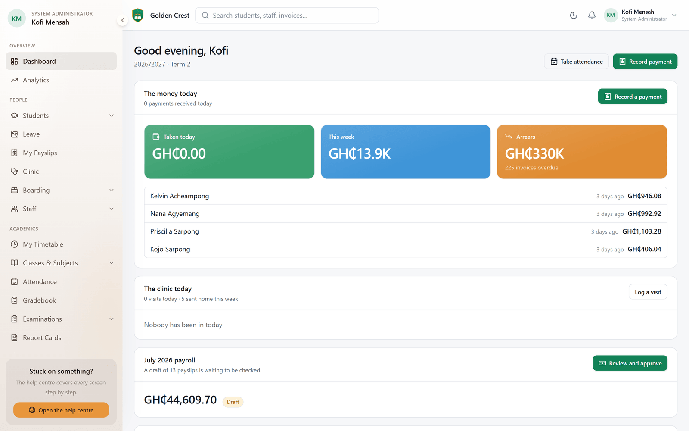

## Part 2: The school year

### 2.1 Academic years and terms

Everything in the system hangs off the academic year. Set it up before anything else.

Go to Academics, then Academic years. Create the year, give it a start and end date, and mark it current. Then add its terms with their own dates.

The term dates matter more than they look. Attendance registers, fee statements and report cards all use them to decide what belongs where. If a term's dates are wrong, figures land in the wrong term and the mistake is not obvious until somebody prints a statement.

### 2.2 Classes, levels and sections

A **class level** is a year group, such as JHS 1 or Primary 4.

A **class section** is one class within it, such as JHS 1 Amber. A section has a capacity, which is the number of children who fit, and a form teacher.

Set up levels first, then sections underneath them. The capacity figure is used by admissions to work out how many places are left, so it is worth getting right rather than leaving at a round number.

### 2.3 Subjects

Add every subject the school teaches under Academics, then Subjects. A subject can be marked as core or elective, and can be restricted to particular levels.

Once subjects exist, connect them to classes. That connection is what tells the gradebook which subjects a class is taught and who teaches them.

### 2.4 The timetable

Academics, then Timetable.

**The day.** The bell schedule is set once, in Settings, and every class shares it: the periods, their times, and which of them are break, assembly or worship. Nothing is placed into a break.

**By hand.** Pick a class, click a cell, choose a subject. The system refuses to put one teacher in two rooms at the same time, and says who is already teaching what and when rather than only that something is wrong. It refuses the same for a class already in a lesson and for a room already booked.

It compares the clock, not the period number. Two classes need not ring the same bells, so JHS 1 period 2 can sit across JHS 2 period 3 while never sharing a number.

**Built for you.** Timetable, then Build it for me.

Before it can run, each subject needs to know how much of the week it gets. That is the one number the builder cannot work without, and the same screen is where it is set: a row per subject per class, with how many periods a week and how many of those should be back to back. A science practical is one lesson that cannot be split, not two singles that happen to be adjacent.

It respects what is already there. Breaks, assembly and anything labelled by hand are never moved, even when you tick "replace". A school that has hand-built Monday and wants the rest filled in around it gets exactly that.

It checks its own work before saving any of it, and if it finds a clash it saves nothing.

Run it twice on the same data and you get the same timetable. That is deliberate: one that cannot be reproduced is one nobody can tell they have improved.

**When it cannot fit everything in.** It says what it could not place and, more usefully, why. Nine times in ten a half-built timetable is not the software: it is a school asking one teacher for more periods than a week holds. The screen names those teachers, says how many periods each is wanted for against how many they can teach, and gives the most that could be placed by any arrangement at all. The answer to that is more teaching staff, fewer periods a week, or a longer day, and none of them is a button.

**When somebody cannot teach.** Time off is recorded per member of staff, either a whole day or a single period. Part-time staff are the usual case, and a builder that does not know Mr Osei is only in on Tuesdays and Thursdays produces a timetable that has to be thrown away.

Timetables can be printed for a class, for a teacher, or for the whole school.

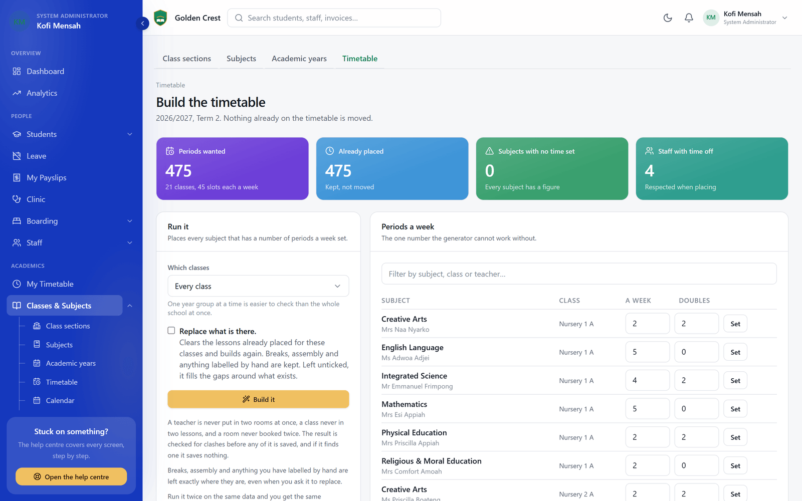

### 2.5 The calendar

The school calendar holds terms, holidays, events, examinations and anything else with a date. It appears on the dashboard, in the guardian portal and in the student portal, so a parent looking for the date of Speech Day does not have to telephone the office.

## Part 3: Pupils

### 3.1 Admissions

Admissions covers everything that happens before a child becomes a pupil.

An application can be entered by the office or arrive through the website enquiry form. Each application belongs to an academic year, so a family turned down one year can apply again the next without any difficulty.

The board shows every applicant in the intake, grouped by the stage they have reached. The stage is worked out from what has actually happened rather than being a field somebody has to remember to change. An applicant who has sat the entrance papers is at the assessment stage because the marks exist, not because anybody said so.

The stages run: enquiry, applied, assessed, interviewed, offered, accepted, enrolled. There are also waiting list and declined.

**Entrance papers.** Record the marks for each paper. The system works out an average and shows it on the board so the shortlist is visible without opening every record.

**Interviews.** Record who came, what was discussed and a recommendation. The notes are shown on the board row, because a one word recommendation with no reasoning behind it is not much use a fortnight later.

The note itself is read by whoever interviews and whoever decides the offers. Everybody else who can open the admissions board sees that an interview happened, when, and what was recommended, and is told a note exists without being shown it. An interview note is prose about a family written in confidence, and the pipeline is a board of who is where.

**Offers.** An offer carries a year group and a date by which the family must reply. Offers that have passed that date are shown first on the board, because nothing releases a held place on its own and a school that forgets will offer the same seat twice.

**The offer letter.** Printed from the row. It is on the school's letterhead, addressed to the guardian on file, and states the year group, the reference, the date the place is held until and what happens if the family does not reply. If the family has already accepted or declined, the letter says so instead of demanding a reply to a question already answered.

**Places.** The Places strip counts, for each year group, how many seats exist from the section capacities, how many children are already enrolled, and how many are promised to somebody. Offers with no year group attached are counted separately so they are not lost.

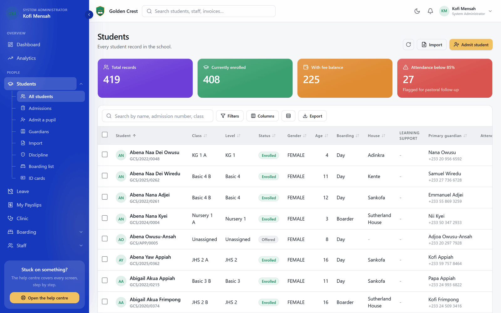

### 3.2 Admitting a pupil

Once a family accepts, enrol the child from the admissions board. The pupil record is created, the status changes, and the child appears in the class you place them in.

You can also admit a pupil directly, without going through admissions, from Students then Admit a pupil. This is the right route for a child transferring in mid year.

Every pupil gets an admission number. The format is set in Settings and the number is never reused.

### 3.3 Guardians and family links

A guardian is a person, not a field on a pupil. Create the guardian once and link them to each of their children. When the family's telephone number changes, it changes in one place.

Each link says what the relationship is, whether that guardian is the primary contact, and whether they are the one who pays. The bill payer flag decides who gets fee reminders, which matters in families where one parent handles the money and the other handles the school.

The family tree view shows siblings at the school, which is useful when a sibling discount is being applied or when the office needs to reach somebody quickly.

### 3.4 Bringing in a lot of pupils at once

Students, then Import. Download the template, fill it in, and upload it.

The import checks the file before writing anything and reports what is wrong line by line. Fix the file and upload it again. Nothing is written until the whole file is acceptable, so a half finished import cannot leave the register in a strange state.

### 3.5 ID cards

Students, then ID cards. Select the pupils and print. Cards carry the school crest, the pupil's photograph, their admission number and a code that can be scanned at the gate.

Staff cards are printed the same way from the staff list.

### 3.6 Discipline

Discipline records are kept per pupil, with the incident, what was decided and who dealt with it. The full record, including the account of what happened and the names of any witnesses, is visible only to staff with the discipline permission.

**What a parent sees.** The guardian portal shows the facts of a record and not the narrative: the date, the category, the sanction, whether it is closed and how it was resolved. It does not show the description or anybody else who was involved.

That split is deliberate and it follows from what the school has already done. When a record is raised the family is notified and told to contact the school, so a portal that then showed them nothing would be sending a parent to a page that denies the thing they were just rung about. The full account is a conversation, held between a form teacher and a family, and other children in it are not a parent to read about.

### 3.7 The end of the year

Academics, then Promotions. Choose the year group, review the list, and promote, repeat or graduate each pupil.

Graduating a pupil moves them out of the active register without deleting anything. Their results, their fee history and their documents stay.

## Part 4: Daily teaching

### 4.1 Lesson notes

Lesson notes, then My notes.

The weekly preparation every teacher writes and the head or head of department vets before the week is taught. The system holds it in the format the form already uses: topic, sub-topic, objectives, relevant previous knowledge, teaching and learning materials, core competencies, the introduction, development and closure, the evaluation and the homework.

**Writing one.** Pick the week, pick the subject, fill it in. It saves as a draft as often as you like and only you can see it. The panel tells you what is still empty as you type, and it will not let you hand in a note with a required section missing, because a note handed in half finished wastes your time and the head's.

**Handing it in.** Submit it and it goes to whoever vets. Once it is with them it cannot be edited: a note that changes after somebody has signed it off is a signature on a document that no longer exists.

**Getting it back.** A note sent back carries the reason, at the top of the note and on your list of weeks. Edit it and hand it in again. Nothing can be sent back without a reason, because a note returned with no remark comes back three times.

**The reflection.** Written after the week, not before, and it stays open even after the note is approved. It is the one part of the form that is honest about how the teaching actually went.

**The weeks.** The strip of numbers is the term. A green dot is a week where every one of your subjects has a note handed in; a red one is a week that has already been taught and does not. Going back and filling in a week you missed is the point of it being there.

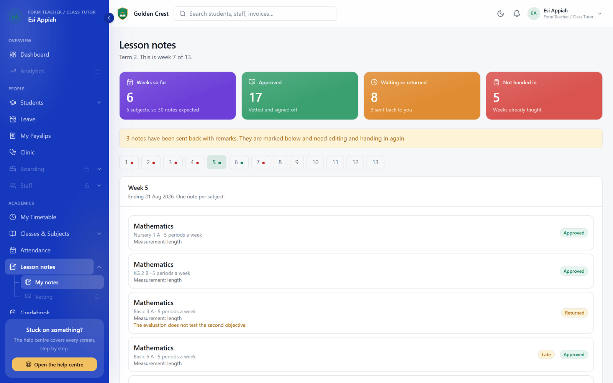

### 4.2 Vetting them

Lesson notes, then Vetting. This needs the vetting permission, which teachers do not have.

The left half is the queue: everything handed in and not yet looked at, oldest week first. Open one, read it, and either approve it or send it back with remarks.

The right half is the half a pile of exercise books cannot do. It lists the teachers who have not handed in a note for weeks that have already been taught, with the subjects. A stack of books tells you who handed in; it says nothing at all about who did not, and that is the person worth knowing about.

A draft does not count as handed in. It is a form somebody opened, not a note anybody has seen.

**Nobody vets their own note.** A head of department who teaches has both permissions and still cannot approve their own work. The button is not drawn and the system refuses it. A note somebody signed off themselves is vetted in the sense that a receipt you wrote yourself is proof of payment.

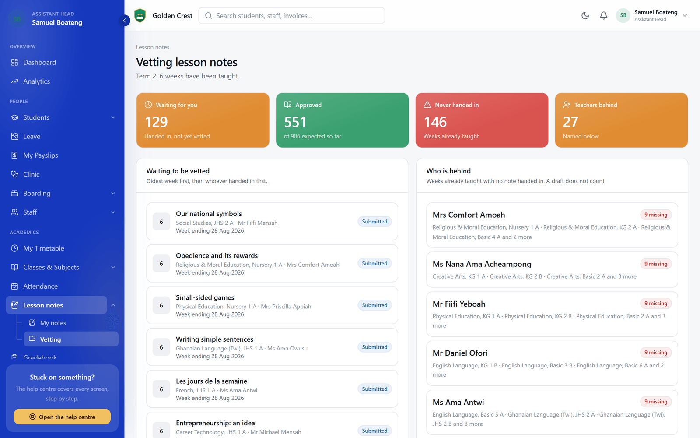

### 4.3 Cover

Cover. Every teacher can read it; arranging it needs the cover permission, which is normally the assistant head's.

Who stands in front of a class when the teacher is not there. Approving leave and covering the lessons that leave creates used to be two jobs in two places, and the second one was done on a piece of paper.

**Where the absences come from.** Nowhere on this screen. They are read out of approved leave every time the page loads. Nobody is typed in as absent, and nobody can be: if a name is missing from "Who is out", that person has leave nobody approved, and approving it on the Leave screen puts them here. Leave cut short on a Tuesday afternoon empties Wednesday's board by itself.

A request that is still pending is not an absence. Cover cannot be arranged against one, because a screen that did so would have granted leave nobody granted.

**The day.** Every period whose teacher is away, in the order the day happens. Each one offers the best free person with one click and the whole list behind "Somebody else".

**How the order is decided.** Somebody who teaches the subject first, so the lesson happens rather than the class being minded. Then somebody in the same department. Then whoever has been asked least today, and then whoever has the lightest day. Anybody who is teaching at that minute, already covering at that minute, or out themselves is not on the list at all.

A free period is not free time. It is when marking and preparation and seeing a parent happen. The list still offers somebody a third cover in one day; it just says out loud that it is the third.

**The four things that can happen.** Another teacher takes it. Somebody supervises set work, which is minding rather than teaching and is named as such. The class merges with another. Or the period is lost, which has to carry a reason, because a term of quietly lost periods is a staffing problem nobody can point at.

**Fill the remaining.** Places every outstanding period at once, best candidate first, re-reading its own work as it goes so nobody is given two rooms at the same minute. It is for ten to seven in the morning. Read the names before the bell.

**On the teacher's side.** Cover appears on My timetable, in both directions: what you have been given, and who is taking your classes while you are away. Whoever is given a period is notified when the decision is made, which is also while they can still say they cannot.

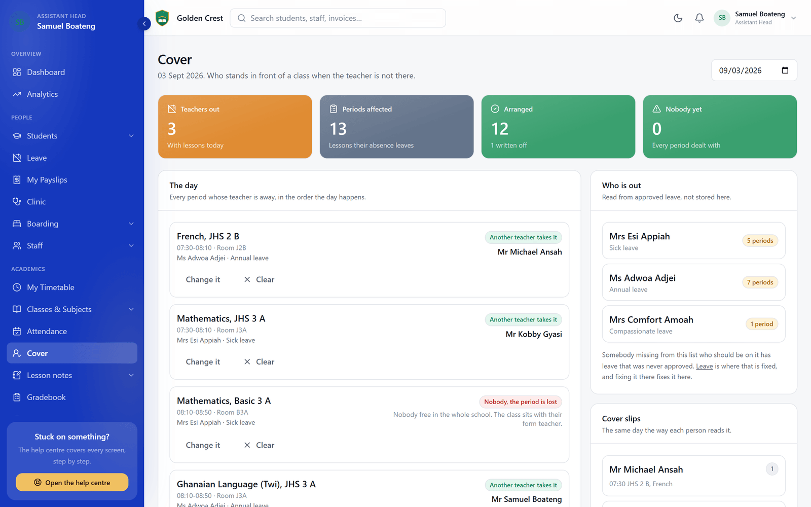

### 4.4 Attendance

Attendance is taken per class per day, or per lesson if the school works that way.

Open Attendance, choose your class, and mark the register. The default is present, so you are marking the exceptions. Save when you are done.

A register that has been submitted can be amended by somebody with the amend permission. Amendments are recorded, so a register is never quietly rewritten.

Attendance reports show patterns rather than single days. A pupil missing every Friday is a different problem from a pupil who was ill for a week, and the report makes that visible.

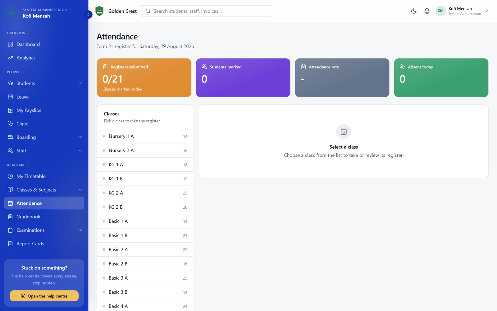

### 4.5 The gradebook

The gradebook is where marks are entered.

Choose your class and subject. You see a mark sheet with every pupil on it and a column for each assessment. Type the marks and save.

A blank is not a zero. If a pupil has not been assessed, leave the cell empty. The system treats an empty cell as "no mark yet" and leaves it out of the average, which is different from treating it as nought out of twenty.

Mark a pupil absent for an assessment rather than giving them zero. An absence is left out of both sides of the calculation. A zero drags the average down and drags the whole class position with it.

### 4.6 Assessments and how they are weighted

A subject's mark is made of components. Typically continuous assessment counts for thirty per cent and the end of term examination for seventy, but the split is set by the school under Settings, then Grading.

Each component has a weight. The subject total is worked out from the weights of the components that actually have marks, so a subject where the examination has not been sat yet shows a continuous assessment result rather than a misleadingly low total.

Grading scales are also set under Settings. A scale turns a percentage into a grade and a remark.

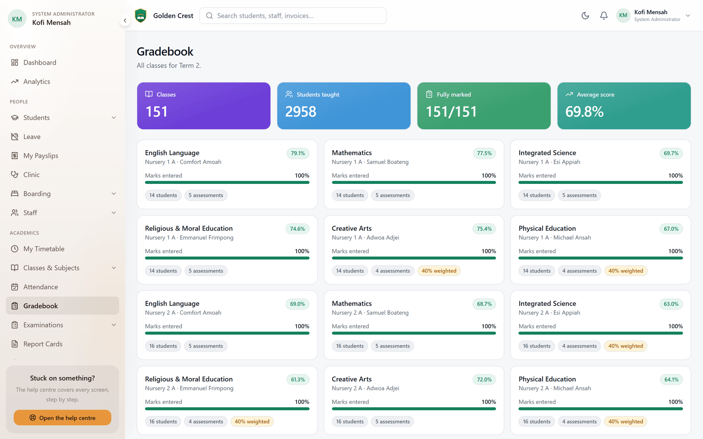

### 4.7 Report cards

Reports, then Report cards.

Generate for a class and a term. The system works out each subject's mark, the total, the average, the grade and the position in class. It also brings in attendance for the term and the form teacher's remark.

Review before publishing. A report card that has been published is visible in the guardian portal, and taking one back after a parent has read it is worse than checking it first.

Report cards print on the school's letterhead. Absences show as "Abs" rather than as a zero, so a parent can see the difference between a child who did badly and a child who was not there.

### 4.8 Examinations

Examinations are handled separately from ordinary class assessments because they involve the whole school at once.

**A sitting** is one examination period, such as End of Term 2. Create it with its dates.

**Papers** are the individual examinations within it. Each paper has a subject, a date, a start time and a duration.

**Halls** are the rooms examinations are held in, with the number of desks in each.

**Seating.** The system allocates candidates to desks across the available halls. Seat numbers are unique within the sitting, so two children cannot be given the same seat even when the halls have similar names.

**Invigilation.** Assign staff to papers. The system will not put a teacher in two halls at the same time.

**Hall lists** are printed per paper and show who should be in the room, where they sit and where to sign.

**Candidate slips** are printed per pupil and show every paper they are sitting, with dates, times and seat numbers.

**Marks** are entered per paper, across every class at once, which is how an examinations officer actually works. The marks flow into the gradebook and onto the report card, so nothing is entered twice.

### 4.9 Transcripts and certificates

Credentials, then Issue. Choose the pupil and the kind of document.

Transcripts pull the pupil's results across the years. Certificates use a template that the school designs under Credentials, then Templates.

Every credential issued gets a verification code. Anybody holding the printed document can check it at the school's public verification address, which is how an employer or a university confirms that a certificate is genuine.

### 4.10 Appraisal

Staff, then Appraisals. Every member of staff sees their own; conducting one is a permission, and so is reading everybody else's.

An appraisal here has two voices and it is built that way on purpose. A document with one signature is a report about somebody, not an appraisal of them.

**The order it happens in.** Whoever manages staff opens one for a year and names who will conduct it. The appraisee writes their own account first, before anybody rates them. The appraiser then rates each of the eight headings, writes the appraisal and sets at least one target. The appraisee reads it and either agrees or records disagreement in their own words.

**Nobody appraises themselves.** However senior. The screen does not offer it, the action refuses it, and the database will not store it. The head is appraised by the governing board, and that record is deliberately kept off this system.

**Only the appraisee signs.** An appraiser cannot mark an appraisal as agreed on somebody's behalf, and cannot record their disagreement for them. That is the whole of what the signature means.

**Disagreeing is a real option.** It needs words, and those words sit on the file beside the appraisal permanently. A disputed appraisal can go back for another conversation and be revised, and the disagreement stays on the record either way.

**What the system holds.** The screen shows what the rest of the system already knows about the period: lesson notes handed in of those the school asked for, registers marked, cover taken on, days away, and the timetabled load that gives all of them their meaning.

These are counts and they are not a score. Nothing is added up, weighted or turned into a rating, and that is a deliberate refusal rather than a thing nobody got round to. A teacher whose notes are late every week because they are covering for two absent colleagues is not a worse teacher than one with an empty timetable and immaculate paperwork. The ratings come from a person who has been in the room; the figures are there so that person is not working from memory.

They are frozen the moment the appraisal is recorded, because a year later the numbers underneath a signed document would no longer be the numbers the person signed against.

**The scale.** Four points and no middle: outstanding, good, developing, needs attention. An odd-numbered scale collects a whole staff room in the centre, which is a way of writing an appraisal without making a judgement.

There is no overall until every heading has been rated. A partial average looks exactly like a whole one, and the heading somebody has not filled in is reliably the one they were avoiding.

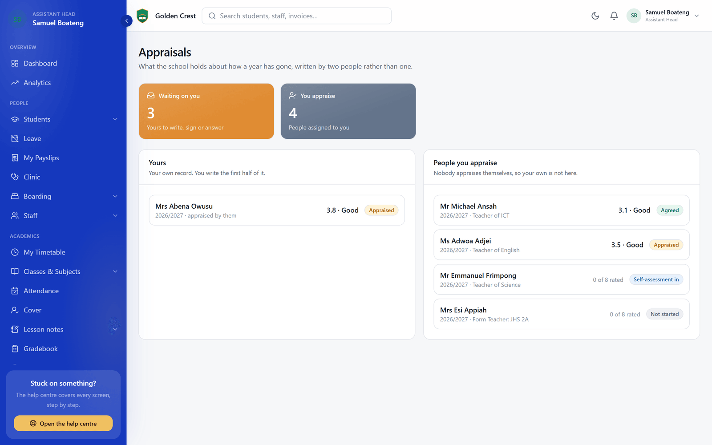

## Part 5: Money

### 5.1 Fee structures

Finance, then Fee structures.

A fee structure says what a particular year group pays in a particular term, broken into lines such as tuition, boarding, transport and examination fees. Set one up per level per term.

Fee categories are defined once and reused. This is what makes the income statement legible later.

### 5.2 Billing monthly instead of termly

Most schools here bill once a term, and that is what a fee structure does unless it is told otherwise. A school that charges a monthly fee sets the structure to bill every month instead.

**Setting it.** On the fee structure, under Finance then Fee structures, choose how often it bills. A monthly structure also needs the day of the month its bills fall due, because one date cannot serve nine bills.

A short month uses its last day. Billing on the 31st gives the 28th in February rather than the 3rd of March, which would be a bill overdue before anything had looked at it.

**Both at once.** The cycle is a property of the structure, not of the school, so a school can publish a monthly tuition structure and a termly examination levy and run them side by side. They are billed separately: choose which kind you are billing when you generate.

**Generating.** Finance, then Invoices. Choose the month. Only months that have already started are offered, because a month cannot honestly be billed before it begins, and a bill raised in advance is one the school then has to withdraw from a family whose child may not be there yet.

**A month belongs to one term.** April is often the tail of one term and the head of the next. The month is filed under whichever term holds more of it, so it is billed once rather than twice, and you do not have to work out which of the two it was.

**Re-running is safe.** A pupil already billed for a month is skipped, and the database refuses a second invoice for the same pupil and the same month whatever the screen believes. Pressing generate twice is the most likely mistake in monthly billing and it is the one a parent notices.

**What a bill looks like.** The month is on the invoice title, so a family with nine bills a year can see at a glance which one they are looking at.

**Existing schools are untouched.** Every structure already published bills termly, which is what it already did, and every invoice already raised has no month against it, which is what a termly bill has. A school that never opens this sees no change at all.

### 5.3 Billing a term

Once the structure exists, generate invoices for the term. The system creates one invoice per pupil, based on the structure for their year group, with any discounts they hold applied.

Invoices carry a number that is never reused and a due date taken from the billing preferences.

Review before issuing. An invoice that has been issued is visible to the family.

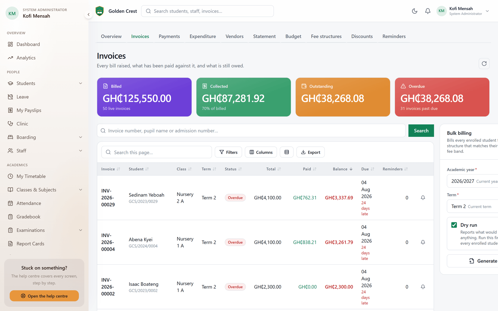

### 5.4 Taking a payment at the desk

Finance, then Payments, then record a payment.

Choose the pupil, enter the amount, choose the method and record it. A receipt number is issued and the receipt can be printed straight away.

The payment is applied to the oldest outstanding invoice first unless you say otherwise. This is what a bursar would do by hand and it keeps the ledger tidy.

Cash, cheque, bank transfer, mobile money, card at a terminal, and scholarship or waiver are all recorded the same way. The method is kept because it is the first question anybody asks when reconciling the bank.

### 5.5 Online payments

If the school has set up a payment provider, guardians can pay from the guardian portal by mobile money or card.

The parent chooses what to pay, is taken to the provider, pays, and is brought back. The system confirms the payment with the provider directly rather than trusting the return trip, and the invoice is settled and a receipt issued.

If the provider's notification is lost, which happens, a scheduled job picks the payment up later, asks the provider what became of it, and settles it. This is why the reconciliation job has to be scheduled before the school takes real money. Section 10.5 covers it.

### 5.6 Discounts and scholarships

Finance, then Discounts. A discount can be a percentage or a fixed amount, and can apply to one fee line or the whole bill.

Sibling discounts, staff discounts and scholarships are all handled the same way. Attach the discount to the pupil and it is applied whenever they are invoiced.

### 5.7 Reminders

Finance, then Reminders. Set how many days before a due date the first reminder goes, how often it repeats, and by which channel.

Reminders respect quiet hours, which are set under Settings. Nobody should get a fee reminder by text message at half past eleven at night.

Reminders go to the bill payer rather than to every guardian.

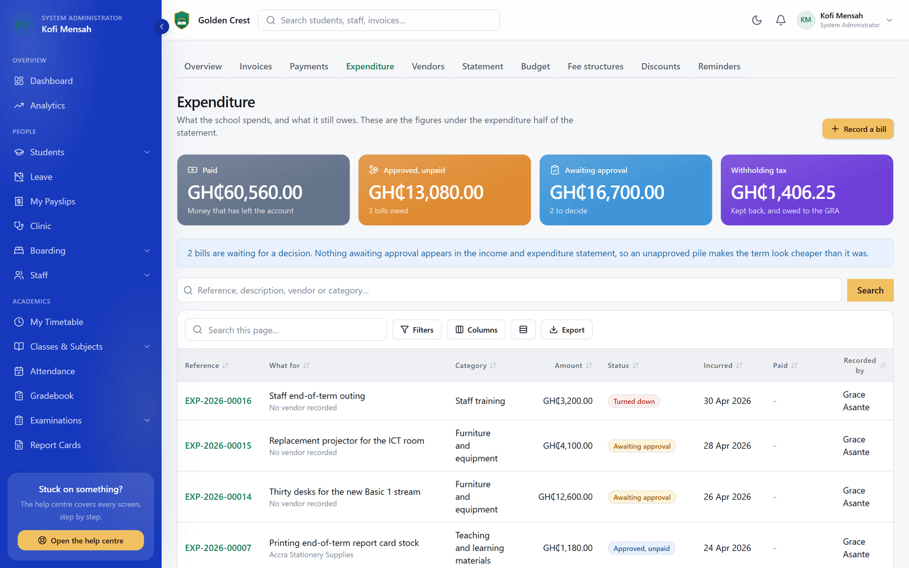

### 5.8 Requisitions

Finance, then Requisitions. Raising one needs the requisition permission, which departments hold; deciding is separate.

A requisition is asking for something before it is bought. Expenditure records what the school spent, which arrives too late to change anything: by the time there is a bill, somebody has promised a supplier money.

**Raising one.** Title it, choose the budget it comes from, list what is wanted with a quantity and an estimated price for each. It saves as a draft and only you can see it. Sending it for approval is a separate button, so a half-written request is not on somebody's desk by accident.

**What the approver sees.** The list of items, the reason, and the budget line: what is left on it before this request, and what would be left after. That figure is the reason for the module. It counts three things and not two.

**Spent, committed, left.** Spent is what has been billed. Committed is what has been approved and has not yet arrived, which is gone as far as this year is concerned even though there is no invoice. Left is the budget less both. Before requisitions existed the budget screen counted only bills, so a line with four approved requests waiting in a drawer read as healthy as one with none, and next year's budget was set from it.

**Nobody decides their own.** However senior. The button is not drawn, the action refuses it, and the database refuses it as well. A school where one person raises and approves has a filing system rather than a control.

**Over budget.** Allowed, and not silent. Approving something that takes a line past its budget asks for a reason, and the reason is kept with the name and the date. Refusing outright would be worked around by not raising the requisition at all, which would lose the record as well as the control. A category with no budget set is a separate case: it is unmeasured, not overspent, and it is not reported as an overspend.

**When it arrives.** Record what actually came, line by line. Half a delivery releases half the commitment: the rest stays against the budget until it turns up. When everything has arrived, mark the requisition met and the commitment is released in full, because the bill now counts it.

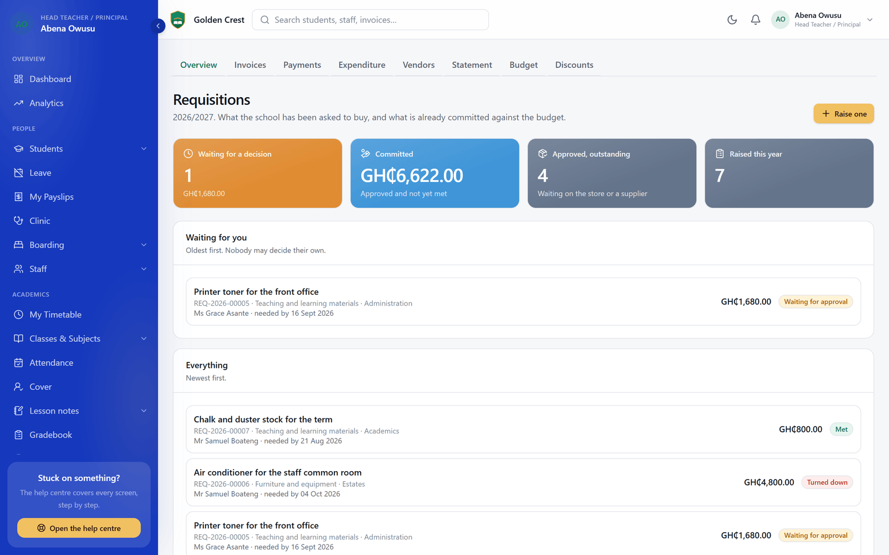

### 5.9 Expenditure and budget

Finance, then Expenditure. Every bill the school pays is recorded here with its category, its supplier, the amount, any withholding tax and whether it has been paid.

Expenditure is approved by somebody other than the person who recorded it. This is deliberate and it is why the head teacher holds the approval permission rather than the bursar.

The budget is set per category per year, and each line carries three figures: what has been spent, what has been committed by approved requisitions that have not yet arrived, and the budget itself. A line is over when the first two together pass the third. The income and expenditure statement shows the budget against the actual, so the governing board can see where the year is going rather than only where it has been.

### 5.10 Payroll

Payroll, then Runs. Set each member of staff's salary and allowances under Salaries, then prepare a run for the month.

The run works out gross pay, deductions including SSNIT and PAYE, and net pay. Review it, then have it approved by somebody with the approval permission, then mark it paid.

Payslips are printed for the whole run or for one person. Staff can also see their own payslips in the system without going to the bursar for a copy.

### 5.11 The general ledger

Finance, then Ledger.

The rest of Part 5 records what a school does with money. The ledger records it a second time, in the form an accountant and an auditor recognise: every transaction as a pair of equal and opposite entries, so the books balance by construction rather than by somebody checking.

**The chart of accounts.** A numbered list of the accounts the school posts to. The ranges follow the usual convention: 1000s for what the school owns or is owed, 2000s for what it owes, 3000s for reserves, 4000s for income, 5000s for expenditure. The system refuses an account whose number does not match its type, because a bank account numbered in the 5000s prints as an expense on the statement and nobody looks at the code afterwards.

**Writing an entry.** Every entry has at least two lines, and the debits must equal the credits before it will save. A line is a debit or a credit, never both and never negative. This is not a formality. An entry that does not balance makes every statement drawn from the ledger afterwards wrong by an amount nobody can find.

**Posting.** Writing an entry and posting it are separate permissions on purpose. Writing it is bookkeeping; posting it is the moment the figure reaches the accounts. In a school small enough that one person does both, they still hold both permissions and nothing is lost. In a school large enough to care, the bursar writes and the head teacher posts.

**Correcting.** A posted entry is never edited. It is reversed, which writes a second entry that is its mirror image, and then the correct one is written. That is how an audit trail works: the record shows what was thought at the time, what was wrong with it, and what replaced it. An edited entry shows only the last opinion.

**The statements.** The trial balance, the income statement and the balance sheet are drawn from the entries every time they are opened. They are not stored figures that could drift from the entries behind them. If the trial balance does not balance, something is wrong with the entries and the screen says so rather than hiding it.

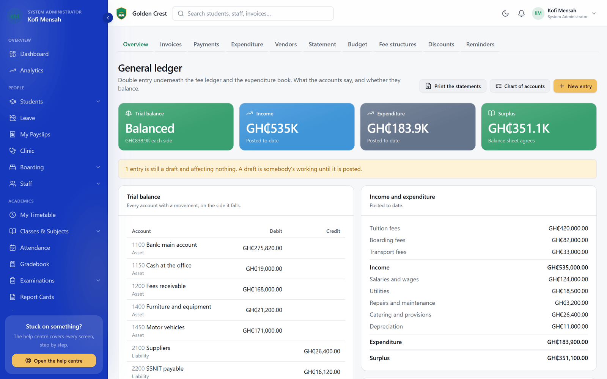

## Part 6: Boarding

### 6.1 Houses, rooms and beds

Boarding, then Houses and rooms.

A house has a house parent and a set of rooms. Each room has a number of beds. The system tracks which bed each boarder is in, not just which house.

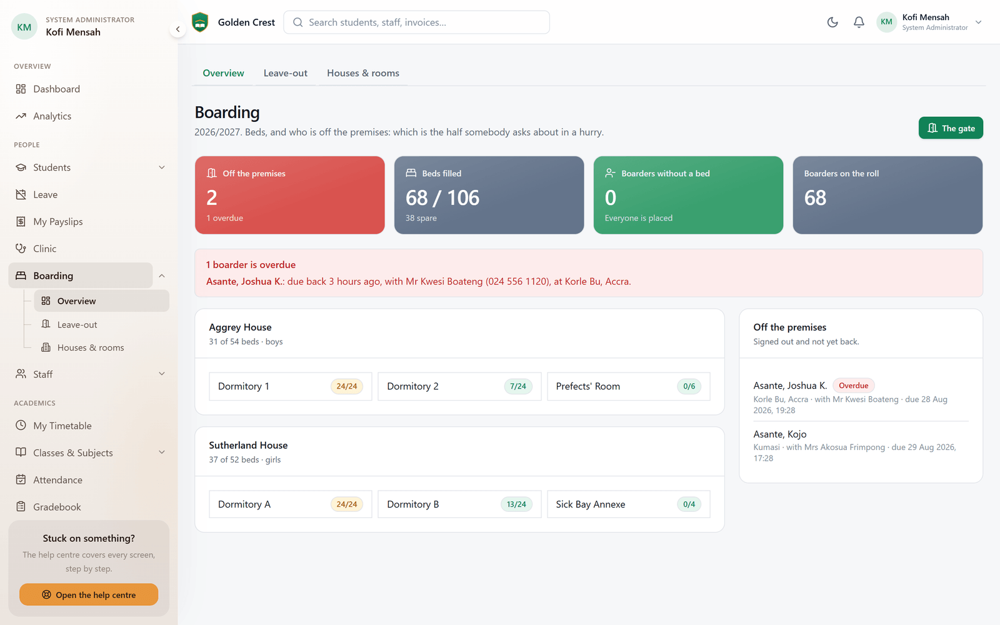

### 6.2 Allocating a bed

From the boarding overview, or from the pupil's record, allocate a bed.

The system will not put a boy in a girls' house, will not put two children in one bed, and will not exceed a room's capacity. If two people allocate the last bed at the same moment, one of them is told, rather than both being told yes.

### 6.3 Leave-out

A leave-out, or exeat, is a boarder leaving the premises and coming back.

Somebody raises it, somebody with authority approves it, and the gate records the pupil out and back in. Each step is a different permission because the point of the process is that one person does not do all three.

A leave-out pass is printed on letterhead for the pupil to carry. It states who they are, who is collecting them, when they are due back and who approved it, and has lines for signatures at the gate.

### 6.4 The gate

The gate screen shows who is currently off the premises and who is overdue. This is the screen a house parent looks at last thing at night.

Overdue leave-outs are shown first, because that is the only part of the list that needs anybody to do anything.

### 6.5 Whose house

A house parent sees their own house. Everything on these screens is filtered to it: the beds, who is off the premises, the leave-out list, and the boarders whose leave-out they can raise. Whoever runs boarding, and the head, see every house.

This is not only tidiness, though a list of three hundred boarders shown to somebody responsible for fifty stops being a list anybody reads. A leave-out row says where a child has gone, who collected them and on what telephone number, and the boarding screens reach a boarder's medical record and their discipline record. A house parent has no more claim to those for another house than any other teacher does.

The rule is enforced where it matters as well as where it shows. A house parent who reaches another house's leave-out by a stale page or a shared link is told it is not their house, rather than quietly being allowed to sign somebody else's boarder back in.

If a house parent sees nothing at all, they have not been recorded as the parent of a house. That is set on the house itself, under Houses and rooms, by whoever manages boarding.

Setting up beds and rooms is deliberately not a house parent's job. Allocating across the school needs to be done in one place by one person, or two houses end up promising the same bed.

## Part 7: What the school owns

### 7.1 The asset register

Assets, then Register.

An asset is a thing that lasts: a bus, a generator, laboratory equipment, furniture. Each one gets a tag, which is what is written on the sticker, and the tag is the only thing anybody can read off the object during a stock take.

Each asset has a category. The category decides how its kind of thing loses value. A laptop over four years, a vehicle over eight, land not at all.

The register works out what each asset is now worth. The method is straight line, charged monthly from the date of purchase, and it never takes anything below its residual value. A projector bought in June is not charged a full year's depreciation in December.

**Movements.** When something moves room or changes hands, record it. The history is what makes the register useful. A projector that went from the hall to a classroom and then could not be found is a different problem from one that was never in the hall.

**Verification.** Once a term or once a year, somebody walks round and confirms things exist. Record what they found. If something cannot be found, record that too. It stays on the register at its full value until somebody decides to write it off, because a thing that turns up in a cupboard next term should not have to be entered again.

**Servicing.** Assets with a service interval, such as buses and generators, are flagged when they are due. An asset that has never been serviced is counted from its purchase date, so it is flagged rather than ignored.

**Disposal.** When something is sold or scrapped, record it with what the school got for it. The system compares that with what the books said it was worth and reports the gain or loss, which is the figure the accounts need.

**The printed register.** Prints on letterhead, with every asset, what it cost, what has been depreciated and what it is now worth, plus totals and a note explaining the basis of the valuation. This is the document an auditor asks for.

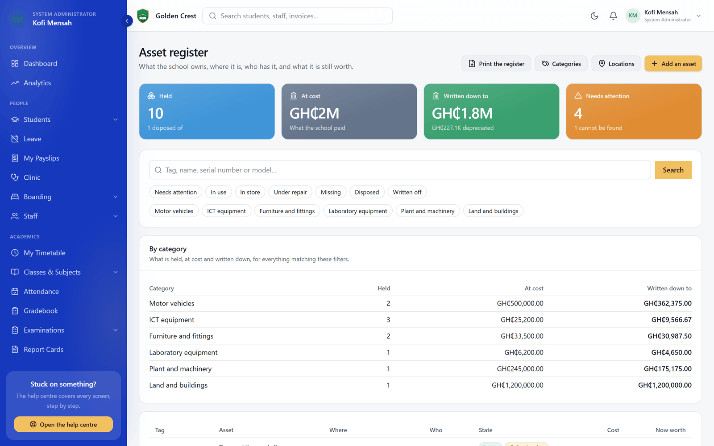

### 7.2 The school store

Store, then Stock.

The store holds what gets used up: exercise books, chalk, cleaning materials, and the provisions the dining hall cooks with.

Each item has a unit, which is how the store counts it, and a reorder level. When the quantity reaches the reorder level the item is flagged. An item with no reorder level is reported as untracked rather than as comfortable, because nothing will ever flag it.

**Receiving.** Record deliveries with the quantity and what each unit cost. The cost is what moves the average.

**Issuing.** Record what goes out, to whom and for which part of the school. A voucher number is issued automatically. Print the voucher and have the person taking the goods sign it. When the term's provisions are audited, the question is not what the database says but who signed for what.

**Counting.** Record what was actually on the shelf. The system works out the difference and records that as an adjustment. A count that agrees writes nothing at all.

**Valuation.** Stock is valued at weighted average cost. Every delivery moves the average and everything issued leaves at it. The balance of an item is the sum of its movements. There is no separate quantity that could disagree with the history.

Nothing can be issued that is not there. If the shelf does not have it, the system says how much is actually there and asks for a count rather than recording a fiction.

## Part 8: The cafeteria

### 8.1 What this part is for

A school kitchen has three jobs: knowing who is entitled to eat, knowing what is being cooked, and knowing who actually ate. The third is the one that matters most and is the one most often missing. A boarding school that cannot say whether a child came to supper cannot say whether a child is missing. A day school billing termly for lunches it did not serve is billing for air.

There is a fourth thing this part does, and it is the reason to set the module up even in a school that is content with its catering arrangements. Every school already holds its pupils' allergies. Almost none of them get that fact to the person holding the ladle. This does.

### 8.2 Meal plans

Cafeteria, then Meal plans.

A plan is a named set of sittings at a termly price. "Lunch only" covers lunch. "Full board" covers breakfast, lunch and supper, which is what a boarder needs. Each plan also carries what one meal costs somebody who is not covered, because a pupil on a lunch plan who turns up to supper is served and charged rather than turned away.

A plan that covers no sittings is refused. It would sell, bill, and then turn the child away at every counter.

Withdrawing a plan stops new families choosing it and leaves everybody already on it exactly where they are.

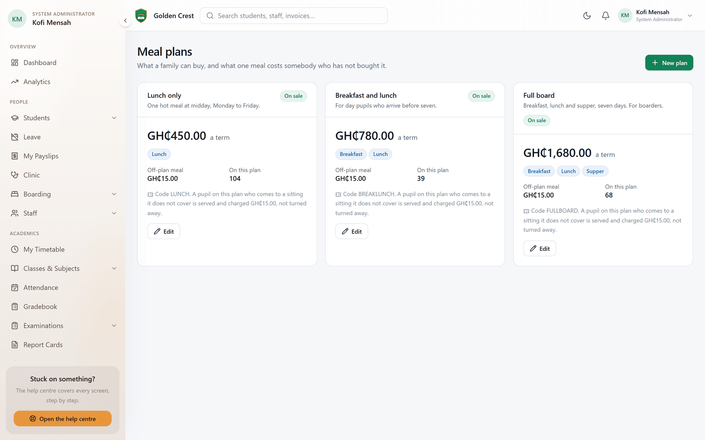

### 8.3 Who is on what

Cafeteria, then Subscriptions.

Put a pupil on a plan for a term. A pupil already on a different plan that term has the old one ended the day before the new one starts, rather than overwritten, so the weeks already billed under it stay explainable.

**Suspending.** A plan can be suspended, usually over arrears. Suspending does not turn a child away from the counter. It moves their meals from the plan to cash, so the school has a record of what was eaten and what it cost. A system that can refuse a child lunch over a billing question is not one a school should be able to run by accident.

**Charging.** Raise the term's charges once from the same screen. Each one is added as a line on that family's existing invoice for the term rather than as a bill of its own, so a parent gets one invoice. A pupil with no open invoice for the term is skipped and counted rather than silently dropped, and the message says how many. Running it a second time finds nothing.

### 8.4 The menu

Cafeteria, then Menu.

The menu is a cycle: a fortnight of dishes that repeats, which is how most kitchens already work. Set how many weeks it runs for and the date the cycle counts from, and the screen works out which week the school is in.

Each dish records what is in it, ticked from a fixed list rather than typed. This matters more than it looks. A pupil's allergy is recorded as free text by whoever took the history, and "groundnut" and "peanut" are the same allergy and a different word. The list is what joins them. A dish with nothing ticked raises no warnings for anybody, which the screen says out loud rather than leaving to be discovered.

Publishing a menu makes it the live one. There is only ever one, because "what is for lunch" is a question that has to have one answer.

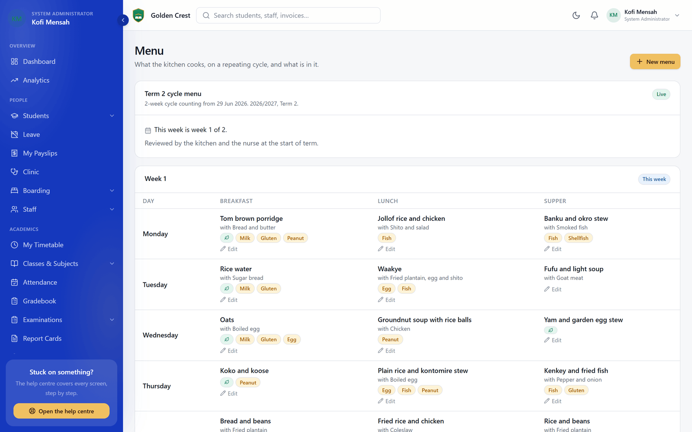

### 8.5 Serving

Cafeteria, then Serving. This is the screen that is open three times a day with somebody standing in front of it.

Open the sitting. That counts who was entitled to it, and that count is what makes the missing list mean anything afterwards. Then find each person by name or admission number and tap to serve them.

Each name shows what the meal costs them: nothing if their plan covers this sitting, or the amount to collect if it does not.

**The warning.** If the dish contains something a pupil is allergic to, it is on the screen before anybody is served, with the severity, the reaction and the treatment as the nurse recorded them. A severe or anaphylactic allergy will not record the meal at all until somebody types what is being given instead. That is deliberately more friction than a tick box. A box gets ticked; a sentence has to be composed by somebody who has looked at the plate. What they type is kept against that meal with their name on it.

If the person serving cannot see medical records, the screen says so plainly rather than showing no warnings. It has not found nothing. It has not looked.

**Closing.** Close the sitting when the hall is empty. That fixes the register: nobody else can be added and nothing can be removed, which is what makes the count of who did not come worth reading. In a boarding house that count is a roll call, not a catering figure.

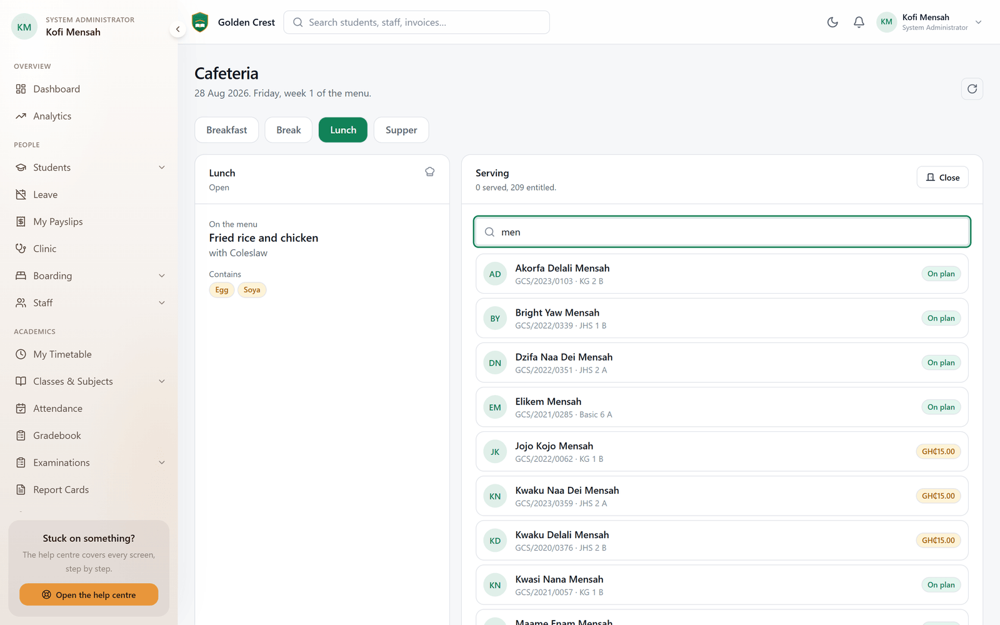

## Part 9: Alumni

### 9.1 What the register is for

A school spends thirteen years building a relationship with a family and loses it in the eighteen months after somebody's last day. The register is the answer to that, and it is worth being clear about what makes it different from a copy of the pupil list.

Every contact detail on it decays. A school email is switched off at graduation. A parent's phone stops being the way to reach a thirty-year-old. So the register keeps their own details, dates them, and records who last confirmed they still work.

That is why the number at the top of the screen is not the number of names. A register of nine hundred people last checked in 2019 reads as nine hundred contactable alumni and is closer to two hundred. The screen shows both figures and the gap between them, because the gap is the only part anybody can do anything about.

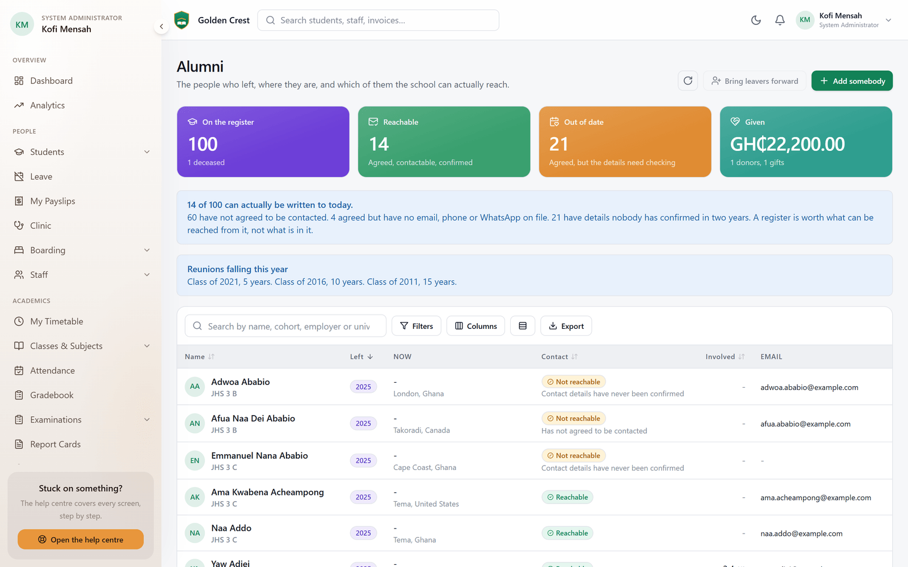

### 9.2 Adding people

Alumni, then Bring leavers forward. That takes this year's graduates and puts them on the register with what the school already knows as a starting point.

Graduates only. A child who left in Primary 4 because the family moved to Kumasi is not an old boy of this school, and adding them turns a list of people with a connection into a list of everybody who ever passed through. Add those by hand if the school disagrees, which makes it a decision rather than a default.

Add somebody by hand for anyone who left before the school had a system. Most schools adopting this have decades of alumni who were never in any software, and a register that can only hold people it already had rows for is a register that starts the year the software was installed.

Record the name they were known by at school when it differs from the name they use now. A register that cannot connect the two cannot find anybody in its own photographs.

### 9.3 Permission to write to them

Nothing may be sent to a former pupil who has not agreed to receive it. Leaving school is not agreement.

Under the Data Protection Act 2012 the school has to be able to say when and how somebody agreed, not merely that a box is ticked, so the record keeps both. Consent with no source recorded is refused. The bring-forward does not tick anybody's box.

The date consent was given is not moved forward when somebody corrects a phone number. It is a fact about a conversation, and restamping it destroys the evidence it exists to be.

### 9.4 Keeping it alive

**Confirming details.** When somebody has actually rung or written and the details are still good, press "Details are current" on the record. Two years later it goes back on the stale list. That one button is the difference between a register and a spreadsheet with a login.

**Recording what they do.** Donations, mentoring, coming to something, speaking at something, offering a placement, or just sending an update. Involvement is scored by what the act cost the person rather than by what it was worth to the school, and it fades over five years: somebody who mentored a pupil last term is more use than somebody who came to a dinner in 2011, and a raw count says the opposite.

The score is deliberately not weighted by the size of a gift. A register sorted by who gave the most stops seeing everybody else, and the person who gives their Saturdays is the one a school actually runs on.

Only a donation carries an amount. An amount recorded against a visit gets added into the donation total by the first report that forgets to filter, and the figure that comes out is wrong in a way nobody can trace back to a row.

**Somebody who has died.** Record the date. The school stops writing to them and they stay on the register, because they are still part of their year group.

## Part 10: Talking to families

### 10.1 Announcements

Communication, then Announcements. Write it once, choose who it goes to, and publish. It appears in the portals and can also be sent out by message.

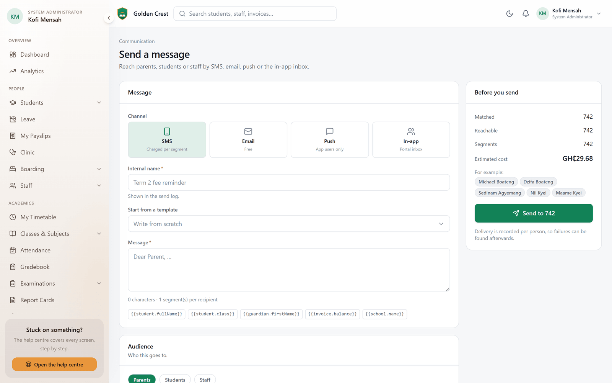

### 10.2 Sending a message

Communication, then Send message.

Choose the audience. You can pick whole year groups, particular classes, all boarders, all guardians with an outstanding balance, or a list of individuals.

Choose the channel. SMS reaches everybody in Ghana. Email carries attachments and long text. Push notifications reach anybody who has installed the app and cost nothing.

Before you send, the system tells you how many people it will reach and roughly what it will cost. Text messages are charged per segment and a long message is several segments, so this is worth reading before pressing send.

After sending, the delivery log shows what actually arrived. "Sent" only means the aggregator accepted it. Whether a parent's telephone rang is a second question, answered later, and the log answers it.

### 10.3 Memos

Memos are internal. They are drafted, approved and issued, and staff see them in the system. Use them for anything that would otherwise be a piece of paper on the staff room noticeboard.

### 10.4 Templates

Templates save you writing the same message every term. They contain placeholders such as the pupil's name, the invoice balance and the due date, which are filled in per recipient when the message goes out.

### 10.5 The website

The system includes the school's public website. Pages are edited under Website, media is uploaded to the media library, and enquiries from the website's contact form arrive in the system rather than in somebody's personal inbox.

An enquiry can be turned into an admissions application without retyping anything.

## Part 11: The portals

### 11.1 The guardian portal

Guardians sign in and see their own children.

They can see fees and what is outstanding, pay online if the school has set that up, see payment history and print receipts, see results once they are published, see attendance, see announcements and the calendar, see library loans, see school bus arrangements, and download documents the school has shared with them.

Guardians see only their own children. This is enforced on every screen rather than by hiding links.

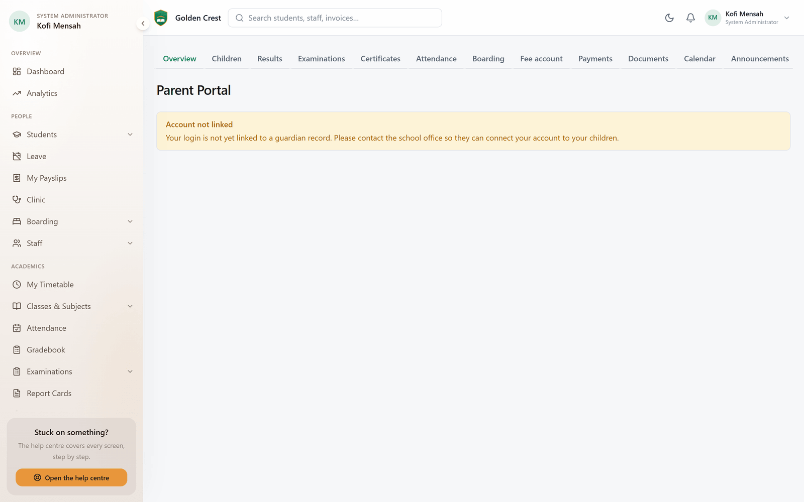

### 11.2 The student portal

Pupils sign in and see their own timetable, assignments, results, attendance, library loans and certificates.

Older pupils can also take part in school elections, which the system runs with a secret ballot and a verifiable receipt.

## Part 12: Running the system

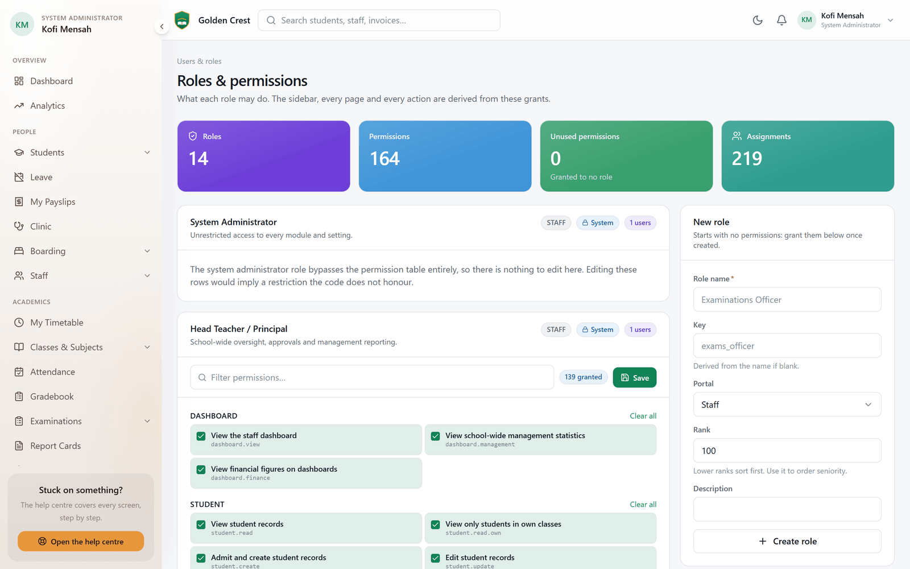

### 12.1 Users and roles

Users, then All users. Create an account by inviting somebody by email. Assign them a role.

A person can hold more than one role. A teacher who is also a house parent holds both, and sees the union of what the two allow.

Users, then Roles, is where roles are edited. Each role is a list of permissions with tick boxes. Change with care and test with a real account afterwards.

### 12.2 Settings

Settings, then School profile, holds the school's name, address, telephone number, crest and motto. These appear on every printed document, so fill them in before printing anything for a family.

Settings, then Dropdown options, controls the lists that appear in dropdowns across the system, so a school can use its own vocabulary.

Settings, then Custom fields, lets the school add its own fields to pupil and staff records without anybody writing code.

Settings, then Grading, holds the grading scales and the weighting between continuous assessment and examinations.

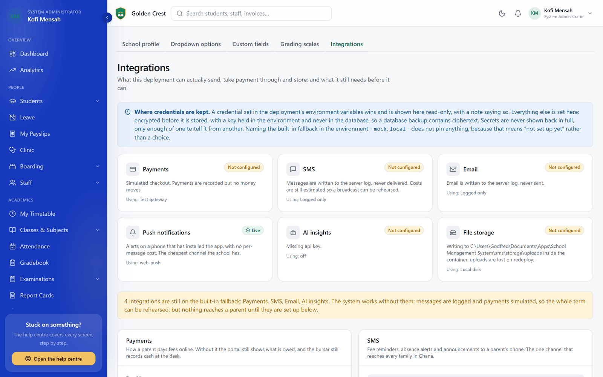

### 12.3 Integrations

Settings, then Integrations, is where the school connects its payment provider, its SMS aggregator, its email host and its notification keys.

Each one has a Test button that contacts the provider there and then and reports what happened. The test costs nothing. For SMS and email there is also a test message, which sends one real message to a number or address you type. That is the only check that proves the whole chain, including whether the sender name is registered with your provider, which is the step that most often fails.

Anything the deployment has fixed in its own environment variables is shown read only, with a note saying so.

Credentials typed here are encrypted before they are stored. They are never shown back in full, only enough of one to tell it apart from another.

### 12.4 The audit trail

Users, then Audit trail. Every significant change is recorded with who did it, what changed and when.

The audit trail is how a disagreement about who altered a mark or reversed a payment gets settled. It is not editable by anybody.

### 12.5 Scheduled jobs

Three jobs need to run on a schedule. They are ordinary web addresses that a scheduler calls with a shared secret.

**Fee reminders.** Marks invoices overdue and sends the reminders that are due. Hourly.

**Message delivery status.** Asks the SMS provider what became of messages already sent and updates the log. Every few hours.

**Payment reconciliation.** Finds payments that started and never finished, asks the provider what became of each one, and settles the ones that turn out to be real. This is not optional once the school is taking real money. Without it, a payment whose notification was lost leaves a family charged with their bill still outstanding, and the reminder job then chases them for money they have already paid.

The README that ships with the system has the exact addresses and the go live checklist.

### 12.6 The report to the board

Reports, then To the board. Print it from the button at the top; it comes out on the school's letterhead.

Every figure in this document already exists on some other screen. What has never existed is the one document, so it gets assembled by hand the week before the meeting out of six screens and a calculator. That is why board papers and the software disagree, quietly and routinely, and why nobody can say which is wrong.

**Every figure says what it counted.** Not "attendance 94%" but "94%, present or late, over 10,100 marks, second term". A board member who cannot see what was counted cannot challenge it, and a figure nobody can challenge is decoration rather than evidence.

**A figure the school cannot state honestly says so.** It is not shown as nought. "Nothing was spent on repairs" and "nobody recorded any repairs" are different sentences, and a board given the first when the second is true will plan next year around it. The front page counts the gaps and each one says why it is missing.

**Comparisons are only drawn where they are fair.** A term four weeks in, set against a whole one, reads as a collapse that did not happen. Where the two periods are not of comparable length the report says so instead of doing the arithmetic.

**Rates change in points, not per cent.** Attendance of 94 against 91 is up three points. Called "up 3%" it is read as a third of what actually happened, which is the confusion that lives in board papers everywhere.

**Money is measured against like.** The budget is annual, so what is set against it is the year's spending and the year's commitments, not the term's. The term's spending is shown too, separately and labelled as such.

## Part 13: What the system prints

Everything in this list prints on the school's letterhead and is generated fresh each time rather than stored, so a document is always current.

Report cards. Transcripts. Certificates. Examination timetables, hall lists and candidate slips. Invoices and fee statements. Receipts. Payslips and the payroll schedule. Admission offer letters. Boarding leave-out passes. Visitor passes. Pupil and staff ID cards. Class registers. The asset register. Store issue vouchers. Transport manifests. The income and expenditure statement. Letters written from the letters module. Any report built in the report builder.

## Part 14: For trainers

### 14.1 Before the first session

Have the system set up with real data before anybody sits down. A training session on an empty system teaches nothing, because every screen says "nothing here yet".

Set up the academic year, the terms, the class levels and sections, the subjects, and at least one full class of pupils. If the school has a previous system, import the pupils first. If not, enter one class by hand as part of the training itself, which doubles as the exercise.

Create a real account for each person you are training, with the role they will actually hold. Do not train everybody on an administrator account. People remember where the buttons were, and if they were on an administrator account, half of them will not be there on Monday.

### 14.2 A suggested order

Train by job, not by module. Five sessions, roughly half a day each.

**Session one: everybody.** Signing in, the shape of the screen, search, changing your password, and what to do when something is not there. Forty five minutes. Everyone attends this one, including the head teacher.

**Session two: the office.** Registrar and front desk. Admissions, admitting a pupil, guardians and family links, ID cards, visitors, and the website enquiry list.

**Session three: teaching staff.** Lesson notes, cover, attendance, the gradebook, assessments, report cards. Say early on that a teacher sees their own classes and not the school, because the first question in this session is always why somebody cannot find a child. This is the largest group and the one where the "a blank is not a zero" point needs making twice.

Do lesson notes first in that session, and do them by writing a real one for next week rather than by describing the screen. It is the part of the system a teacher touches most often, and the part where the difference between a form and a habit is decided in the first fortnight.

**Session four: the bursar.** Fee structures, invoicing a term, taking payments, discounts, reminders, expenditure and payroll. Longest session. Do it separately and do not rush it.

**Session five: heads of department and senior staff.** Examinations, analytics, reports, memos, approvals. Requisitions belong here too: this is the group who raise them.

**Session six: the head, and whoever sits on the board.** Appraisal, and the report to the board. Print the board report during the session and read it round the table. The argument for it is not that it saves an afternoon, though it does; it is that everybody is then looking at figures that say where they came from, and that the ones the school cannot yet produce are named rather than quietly absent.

Boarding, the asset register, the store, the cafeteria and the alumni register are trained separately with the people who actually run them, usually an hour each.

The cafeteria session is the one to do standing at the counter with the screen the kitchen will actually use, not in a classroom. Do it with a real pupil who has an allergy on file and a dish that contains it, so the people serving see the warning once before the day it matters.

### 14.3 Exercises that work

Give people a task and a piece of paper, not a demonstration to watch.

For teachers: here is a register with four absences on it, enter them. Here is a mark sheet with one pupil who was away for the test, enter it correctly.

For the office: here is an application form, enter it, record the entrance marks, record the interview, make the offer, print the letter.

For the bursar: here is a term's fee structure, bill the term, then take these five payments, two of which are part payments.

For house parents: allocate these four boarders to beds, then process a leave-out from request to gate.

Then ask them to find something they entered an hour ago. Finding things again is the skill people lack, and search is the answer to most of it.

### 14.4 The things people get wrong in the first week

**Entering marks against the wrong term.** Show people where the term selector is and make them look at it before they type.

**Treating an absence as a zero.** Say it twice. A zero drags the average down and moves everybody's position in the class.

**Expecting to see everything.** The system hides what a role cannot use. When somebody says a feature is missing, check their role first.

**Publishing report cards before checking them.** Once published, a parent can see them.

**Forgetting that the sender name has to be registered.** Schools sign up with an SMS provider, send a test, and nothing arrives. It is almost always the sender name, and the provider has to register it. This is not something the school can fix at their end.

**Not scheduling the reconciliation job before going live with online payments.** Covered in section 10.5. It matters.

### 14.5 Questions you will be asked

**"Can I undo it?"** Mostly yes, and the change is recorded either way. Payments are reversed rather than deleted. Stock corrections are another movement rather than an edit. Nothing important is quietly rewritten.

**"Where did that number come from?"** Every figure on a screen has a source you can open. Class positions come from subject marks, subject marks come from components, and components come from what somebody typed in the gradebook.

**"What if the internet goes down?"** The system needs a connection. What it does not need is for the school to have signed up with anybody: messages are logged rather than sent, payments are simulated, and everything else works normally, so the school can run a full term as a rehearsal before committing to a single provider.

**"Who can see my child's records?"** Guardians see only their own children. Teachers see the classes they teach. Medical information and disciplinary records have their own permissions on top of that.

## Appendix A: The permission groups

Permissions are grouped by area. The groups are: dashboard, student, staff, payroll, academic, attendance, assessment, admission, boarding, finance, asset, stock, communication, document, election, lms, report, ai, website, visitor, letter, transport, library, settings, user and portal.

Within each group, permissions are separated by what they let you do rather than by which screen they are on. In finance, reading the ledger, recording a bill and approving one are three different permissions, so the person who records expenditure cannot approve it. In stock, issuing goods and correcting the book after a count are separate for the same reason.

The full list, with a description of each permission, is on the Roles screen.

## Appendix B: Glossary

**Academic year.** The school year the system is currently working in.

**Admission number.** The unique reference given to a pupil when they join. Never reused.

**Continuous assessment.** Class work, tests and assignments taken during the term, as distinct from the end of term examination.

**Custodian.** The member of staff answerable for an asset that has been signed out to them.

**Exeat.** A boarder's authorised absence from the premises. Called a leave-out in this manual.

**Form teacher.** The teacher answerable for a class section, who writes the remark on the report card.

**Invoice.** A bill issued to a pupil for a term.

**Net book value.** What an asset is worth after depreciation. Its cost less everything written off so far.

**Reorder level.** The quantity at which a stock item should be bought again.

**Segment.** One text message's worth of characters. A long message is charged as several.

**Sitting.** One examination period, containing many papers.

**Voucher.** The signed slip recording goods issued from the store.

**Weighted average cost.** How the store values stock. Each delivery moves the average and everything issued leaves at it.
